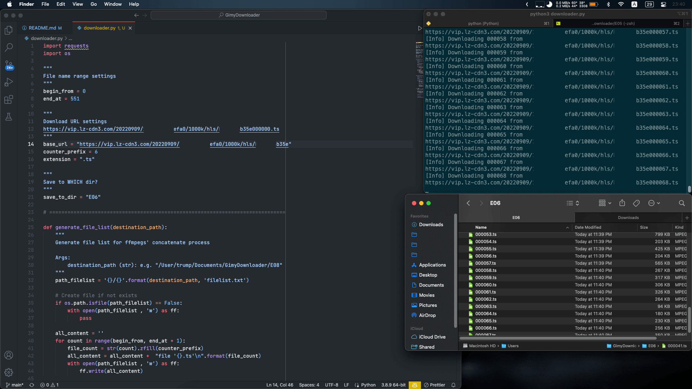

<div align="center">
  


<h1>GimyDownloader</h1>

<h4>
Download vids from Gimy<br>
Made by programmer, made for programmer<br>
</h4>


<p align="center">
  <a href="#preview">Preview</a> •
  <a href="#requirement">Requirement</a> •
  <a href="#usage">Usage</a>
</p>
</div>

## Preview



## Requirement

- Python 3.8 and above
- ffmpeg 5 and above

## Usage

### Step 1 - Download

Prepared? on command line run:

```shell
python downloader.py
```

### Step 2 - Concatenate files

Refer: [Concatenating media files](https://trac.ffmpeg.org/wiki/Concatenate)

Navigate to episode folder and run:

```
ffmpeg -f concat -i filelist.txt -c copy output.ts
```

### Step 3 - Enjoy